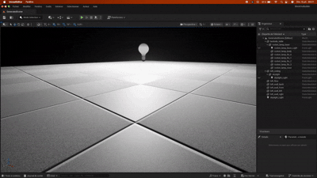

# UnrealGPT – Procedural Scene Generation & Build

## Engine & Tools

* **Unreal Engine** ≥ **5.3** (project was built and tested on 5.6 Preview but any 5.3+ should work).
* **Python** 3.10 (used for both prompt parsing and scene building).

---

## 1. Set-up

```bash
# Clone repo & enter directory
$ git clone <this-repo> UnrealGPT && cd UnrealGPT

# (optional) create a virtual-env
$ python -m venv .venv && source .venv/bin/activate

# Install Python deps
$ pip install -r requirements.txt

# Set your OpenAI API key (needed for parse_prompt)
$ export OPENAI_API_KEY="sk-..."
```

---

## 2. One-command demo

`demo/run_demo.sh` is a self-contained pipeline:

1. checks Python dependencies and the `OPENAI_API_KEY` variable
2. sends the prompt to GPT → writes **demo/scene.json**
3. asks for (or auto-detects) your Unreal Engine executable and `.uproject`
4. launches UE in head-less mode, runs `unreal/BuildScene.py`, saves the level

Run it from the repo root:

```bash
./demo/run_demo.sh
```

### Customising the demo

* **Prompt** – open `demo/run_demo.sh` and change the `DEMO_PROMPT` string at the top.
* **Unreal paths** – you can hard-code `UNREAL_ENGINE_PATH` and `UNREAL_PROJECT_PATH` in the same script to skip the interactive questions.
* **Log file** – build output is saved to `demo/unreal_build.log` for troubleshooting.

Outputs:  `BlockOutBuilder/Content/Maps/GeneratedScene.umap`

Open *GeneratedScene.umap* in Unreal to inspect the block-out.

---

## 3. Custom prompt

```bash
# Edit and run any prompt you like
$ python src/parse_prompt.py "My custom scene description here"

# then rebuild
$ python unreal/BuildScene.py demo/scene.json
```

The same map file will be overwritten with the new layout.

---

## 4. Editing / Iterating

1. Change your prompt and rerun **parse_prompt.py** → generates a fresh *scene.json*.
2. Run **BuildScene.py** again → spawns / updates actors in a new level.

Because the .umap filename is the same each run, you can simply reopen the map (or press **Ctrl + S** in the Editor after the script finishes to save the new state).

---

## 5. Preview

DEMO_PROMPT="Give me a cosy loft with a skylight and put a rocket-shaped lamp on the bedside table."


